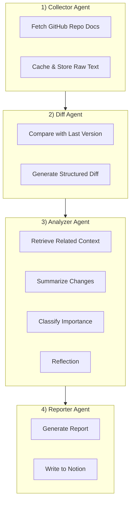

# Docswatch Agent

Docswatch는 GitHub 오픈소스 레포지토리의 문서(Markdown)를 주기적으로 수집하고,
변경 사항을 분석하여 요약 리포트를 생성한 뒤 Notion에 기록하는
멀티 에이전트 기반 문서 업데이트 감지 에이전트입니다.

본 프로젝트는 LangGraph를 활용한 에이전트 개발 학습 및
향후 에이전트 개발 플랫폼 구축을 위한 PoC를 목적으로 합니다.

---

## Features

- GitHub Repository 문서 자동 수집
- 이전 버전 대비 변경 사항(diff) 분석
- LLM 기반 변경 요약 및 중요도 분류
- Self-RAG / Corrective RAG 구조 적용
- Notion으로 변경 리포트 자동 기록
- LangGraph 기반 멀티 에이전트 오케스트레이션

---

## Architecture



---

## Project Structure

```text
docswatch/
├── run.py
├── README.md
├── requirements.txt
├── .env
├── src/
│   ├── agents/
│   │   ├── collector.py
│   │   ├── diff_agent.py
│   │   ├── analyzer.py
│   │   └── reporter.py
│   ├── graph/
│   │   └── workflow.py
│   ├── utils/
│   │   ├── github_client.py
│   │   └── memory.py
│   └── config/
│       └── settings.py
└── tests/
    ├── test_collector.py
    ├── test_diff.py
    ├── test_analyzer.py
    ├── test_reporter.py
    └── test_workflow.py
```
---

## Setup

### Python Environment
```bash
    python3 -m venv venv
    source venv/bin/activate
    pip install -r requirements.txt
```
### Environment Variables
```text
    OPENAI_API_KEY=sk-xxxx
    GITHUB_TOKEN=ghp_xxxx
    NOTION_TOKEN=secret_xxxx
    NOTION_PAGE_ID=xxxxxxxxxxxx

    export $(grep -v '^#' .env | xargs)
```
---

## Run
```python
    python run.py
```
---

## Test
```python
    python tests/test_collector.py
    python tests/test_diff.py
    python tests/test_analyzer.py
    python tests/test_reporter.py
```
---

## Tech Stack

- Python 3.12
- LangGraph / LangChain
- OpenAI API
- GitHub API
- Notion API

---

## Purpose

- 에이전트 개발 실습 및 설계 경험 축적
- 멀티 에이전트 오케스트레이션 구조 이해
- 에이전트 개발 플랫폼 설계를 위한 PoC
- 테스트입니다
